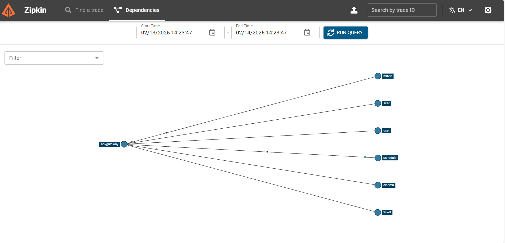

# Movie-Reservation-System 

Welcome to the **Movie Reservation System**, a microservice-based application designed to manage movie reservations efficiently. This system allows users to browse available movies, book tickets, and manage user roles, all while ensuring a seamless experience.

### **Features**
- **User Authentication and Authorization**:
  - Users log in using JWT-based security.
  - Role-based access control (Admin, User).

- **Movie Management**:
  - Browse available movies.
  - Fetch detailed information about movies using Feign Clients.

- **Ticket Booking**:
  - Book tickets dynamically based on movie schedules, available seats, and pricing.
  - Automatic seat availability management.

- **Notifications**:
  - Users receive personalized notifications for successful bookings.

- **Microservices Architecture**:
  - Services like UserService,MovieService,CinemaService, SeatService, ScheduleService,TicketService and NotificationService are independently managed.

---
### **Technologies Used**

- **Java 21**: Modern features for cleaner and more efficient code.
- **Spring Boot**: For building the microservice architecture.
- **Spring Security**: JWT-based security for authentication and authorization.
- **Spring Data JDBC**: Easy database access and management.
- **Feign Client**: For inter-service communication in a declarative style.

#### **Containerization**
- **Docker**: For simplifying deployments by containerizing application services.

#### **Message-Driven Communication**
- **RabbitMQ**: For publishing and consuming notifications.

#### **Database**
- **PostgreSQL**: Relational database to store user, movie, ticket, and related data.
#### **Microservices**
- **Eureka**: For service discovery
  
  
- **Zipkin**: For distributed tracing
  
- 
### **Running with Docker**
   ```bash
      git clone https://github.com/Levantosina/Movie-Reservation-System.git
   ```
  ```bash
      cd Movie-Reservation-System
   ```
  ```bash
      mvn clean package
   ```
  ```bash
      docker-compose up --build
   ```
    

### **API Endpoints**

#### **User service**
1. Role user

   - **POST /api/v1/auth/login** : User login to get a JWT token. 
   - **POST /api/v1/users**: Register a new user
   - **PUT /api/v1/users/{userID}** : Update a user
   - **DELETE /api/v1/users/{userID}** : Delete a user

2. Role admin

   - **POST /api/v1/admin/reset-password** : Reset Admin password.
   - **POST /api/v1/users/login** : Admin login to get a JWT token.
   - **POST /api/v1/admin**: Register a new admin
   - **PUT /api/v1/admin/{userID}** : Update a user
   - **DELETE /api/v1/admin/{userID}** : Delete a user
   
#### **Movie service**

1. Role user and admin
   - **GET /api/v1/movies** : Get all movies

2. Role Admin
   - **Post /api/v1/movies** : Register a new movie
   - **PUT /api/v1/movies/{movieId}** : Update a movie
   - **DELETE /api/v1/movies/{movieId}** : Delete a movie
   
#### **Cinema service**

1. Role user and admin
    - **GET /api/v1/cinemas** : Get all cinemas
   
2. Role Admin
    - **Post /api/v1/cinemas** : Register a new cinemas
    - **PUT /api/v1/cinemas/{cinemaId}** : Update a cinemas
    - **DELETE /api/v1/cinemas/{cinemaId}** : Delete a cinemas
   
#### **Seat service**

1. Role user and admin
    - **GET /api/v1/seats** : Get all seats
   
2. Role Admin
    - **Post /api/v1/seats** : Register a new seat
    - **PUT /api/v1/seats/{seatId}** : Update a seat
    - **DELETE /api/v1/seats/{seatId}** : Delete a seat
   
#### **Schedule service**

1. Role user and admin

    - **GET /api/v1/schedules** : Get a schedule list
   
2. Role Admin
    - **POST /api/v1/schedules** : Register a new schedule
    - **PUT /api/v1/schedules/{scheduleId}** : Update a schedule
    - **DELETE /api/v1/schedules/{scheduleId}** : Delete a schedule
   
#### **Ticket service**

1. Role user and admin
    - **GET /api/v1/ticket/myTickets** : Get ticket for authorized user
    - **POST /api/v1/ticket**: Create a new ticket
2. Role Admin

    - **PUT /api/v1/ticket/{ticketId}** : Update a ticket
    - **DELETE /api/v1/ticket/{ticketId}** : Delete a ticket
    - **GET /api/v1/ticket** : Get all ticket

### **How to Contribute**
1. Fork the repository.
2. Clone your forked repository:
    ```bash
    git clone https://github.com/your-username/movie-ticket-booking-system.git
    ```
3. Create a new branch for your feature/bugfix:
   ```bash
   git checkout -b feature-name
   ```
4. Make changes and commit them:
   ```bash
   git add .
   git commit -m "Add a new feature or fix a bug"
   ```
5. Push changes:
   ```bash
   git push origin feature-name
   ```
6. Submit a pull request.

---


### **Contact**

If you have questions or suggestions, feel free to reach out:

- **Email**: levantosina1992@gmail.com
- **GitHub**: (https://github.com/levantosina)